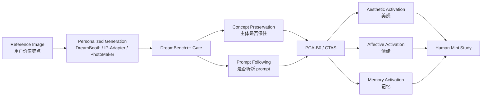

# PCA-B0 组会汇报简稿

生成日期：2026-05-26

## 0. 汇报标题

**主体一致性约束下的感知激活生成：从保主体到打动人**

英文可写：

**Subject-Preserving Perceptual Activation in Reference-Guided Image Generation**

## 1. 我想做什么

我现在想做的不是证明某个指标永远正确，也不是单纯做一个更高分的美学模型。

我的核心问题是：

> 在主体一致性已经被保证的前提下，如何让生成图像更有美感、更能打动人、更能激活人的记忆？

这意味着我把任务分成两层：

```text
第一层：主体一致性是门槛。
第二层：通过门槛后，再优化美感、情绪、记忆和意义联想。
```

所以我的项目不是追求“像原图”本身，而是研究：

```text
Reference image 不是复制模板，
而是用户价值和记忆的锚点。
```

我暂时把这个方向概括成：

```text
Good Output =
  Subject Consistency Gate
  + Causal-Temporal Perceptual Activation
  + Human Memory Calibration
```

## 2. 我的理论押注

我现在的理论押注是 **CTAS: Causal-Temporal Activation Space**。

它的意思是：主体、美感、情绪、记忆不是几个互不相关的分数，而是可能互相影响的潜变量。

| 变量 | 含义 | 例子 |
|---|---|---|
| `S_id` | 主体/身份/对象不变量 | 人、动物、物件、关键身份特征不能丢 |
| `S_aes` | 审美空间 | 色彩、构图、光影、质感、复杂度、流畅性 |
| `S_affect` | 情绪空间 | 温暖、孤独、庄严、怀旧、震撼 |
| `S_mem` | 记忆空间 | 个人经历、物件线索、时代感、文化符号 |
| `T_early/mid/late` | 扩散时间阶段 | 早期锁主体，中期调情绪/构图，后期调质感/美感 |

关键不是把这些合成一个总分，而是研究它们的关系：

```text
S_aes 可能伤害 S_id。
S_layout 可能改变 S_affect。
S_mem 可能需要特定 S_aes。
S_id 一旦失败，S_mem 基本失效。
```

## 3. Baseline paper 选录

这里的 baseline 不是“都要做完”，而是为了组会说明这个领域已经有哪些典型路线。

| 类别 | Paper / 方法 | 为什么放进 baseline |
|---|---|---|
| 源头基线 | DreamBooth | 少量主体图微调生成模型，定义 subject-driven generation 的经典起点 |
| 轻量 token 路线 | Textual Inversion | 用 learned token 表示新概念，适合说明 personalization 的低成本路线 |
| 多概念微调 | Custom Diffusion | 支持多概念定制，能暴露多主体/多潜空间互扰问题 |
| 主体表示路线 | BLIP-Diffusion | 用预训练 subject representation 做可控生成 |
| 图像提示路线 | IP-Adapter | decoupled cross-attention 接入图像提示，最适合 reference-guided workflow |
| 人像身份路线 | PhotoMaker / InstantID | 人脸身份保持强，但只代表 identity 子域，不代表所有主体 |
| 评估框架 | DreamBench++ | 用 human-aligned benchmark 同时评估 concept preservation 和 prompt following |

建议汇报时不要把这些讲成一堆方法，而讲成四条路线：

```text
Fine-tuning route: DreamBooth / Custom Diffusion
Token route: Textual Inversion
Adapter route: IP-Adapter / PhotoMaker / InstantID
Benchmark route: DreamBench++
```

## 4. 主押论文

我建议主押：

**DreamBench++: A Human-Aligned Benchmark for Personalized Image Generation**

理由：

1. 它最贴近我当前问题里的“主体一致性门槛”。
2. 它不是只提出一个生成方法，而是尝试定义 personalized generation 应该怎么评价。
3. 它把评价拆成 `concept preservation` 和 `prompt following`，这比单纯“像不像参考图”更合理。
4. 它有项目页、GitHub、数据和 leaderboard，适合组会展示和后续实验复现。
5. 它可以成为 PCA-B0 的第一层 gate；我的创新空间在 gate 之后：美感、情绪、记忆激活。

需要注意：

```text
DreamBench++ 是 ICLR 2025 顶会开源论文，不是严格意义的期刊论文。
如果组会必须强调“顶刊”，可以用 T2I-CompBench++ TPAMI 2025 做组合结构评估的顶刊背书。
但若汇报主题是主体一致性，DreamBench++ 更适合做主论文。
```

## 4.1 2026 最新补充

为了回应“有没有 2026”，建议加两篇补充，不替代主线：

| 角色 | 论文/方法 | 定位 |
|---|---|---|
| 最新 benchmark | DSH-Bench | 2026 arXiv，面向 subject-driven T2I 的难度/场景感知 benchmark，提出 SICS 指标，评估 19 个模型 |
| 最新开源方法 | Personalize Anything | AAAI 2026，training-free personalized generation，基于 Diffusion Transformer，支持 timestep-adaptive token replacement 和 patch perturbation |

汇报策略：

```text
DreamBench++ = 稳，适合定义主体 gate。
DSH-Bench = 新，说明 2026 年主体一致性评估正在变细。
Personalize Anything = 新且开源，说明 2026 年方法开始从 U-Net diffusion 转向 DiT / training-free personalization。
```

我建议不要把主押论文换成 DSH-Bench，因为它还只是 arXiv；也不要完全换成 Personalize Anything，因为它是方法论文，不如 DreamBench++ 适合作为“主体性定义和评估”的主锚点。

## 5. DreamBench++ 可以怎么讲

### 5.1 它解决什么问题

个性化图像生成里有两个冲突目标：

```text
既要保留主体，又要听 prompt。
```

如果只追求主体相似，图像可能僵硬、不能泛化。

如果只追求 prompt following，主体可能漂移。

DreamBench++ 的核心价值是把这两个维度明确拆开：

```text
Concept Preservation: 主体是否保住
Prompt Following: 新场景/新动作/新风格是否跟随
```

### 5.2 它和我课题的关系

DreamBench++ 解决的是第一层：

```text
有没有守住主体？
```

我的 PCA-B0 / CTAS 继续往后问：

```text
守住主体之后，哪一张更美？
哪一张更动人？
哪一张更能激活记忆？
能不能通过扩散时间阶段控制，让美感/情绪增强不破坏主体？
```

因此我的研究不是替代 DreamBench++，而是把它作为前置 gate，再扩展到 perceptual activation。

## 6. 一页信息图逻辑



## 7. 组会 5 分钟讲法

### 第 1 分钟：问题

我的问题不是“如何让图更像参考图”，而是“参考图作为主体和记忆锚点被保住后，如何让输出更美、更动人、更能唤起记忆”。

### 第 2 分钟：领域 baseline

主体一致性已有多条路线：DreamBooth 代表微调，Textual Inversion 代表 token，IP-Adapter 代表图像提示，PhotoMaker/InstantID 代表人像身份，DreamBench++ 代表评估框架。

### 第 3 分钟：主论文 DreamBench++

DreamBench++ 的价值是把 personalized generation 的评价拆成 concept preservation 和 prompt following，并做 human-aligned benchmark。这正好能做我的主体 gate。

### 第 4 分钟：我的差异

我不把主体一致性作为终点，而把它作为门槛。通过门槛后，我研究美感、情绪、记忆激活，以及这些变量在扩散时间阶段中如何被安全调制。

### 第 5 分钟：下一步

下一步做一个最小实验：用 IP-Adapter/DreamBooth 生成候选，先用 DreamBench++ 思路或 CLIP/DINO/VLM 做主体 gate，再用 ImageReward、EmotionCLIP、LaMem/THINGS proxy 和人类小样本做 activation ranking。

## 8. 参考链接

- DreamBench++ project: https://dreambenchplus.github.io/
- DreamBench++ code: https://github.com/yuangpeng/dreambench_plus
- DSH-Bench: https://arxiv.org/abs/2603.08090
- Personalize Anything code: https://github.com/fenghora/personalize-anything
- DreamBooth paper: https://arxiv.org/abs/2208.12242
- DreamBooth project: https://dreambooth.github.io/
- Textual Inversion: https://arxiv.org/abs/2208.01618
- Custom Diffusion: https://arxiv.org/abs/2212.04488
- BLIP-Diffusion: https://arxiv.org/abs/2305.14720
- IP-Adapter: https://arxiv.org/abs/2308.06721
- PhotoMaker: https://arxiv.org/abs/2312.04461
- InstantID: https://arxiv.org/abs/2401.07519
- T2I-CompBench++: https://github.com/Karine-Huang/T2I-CompBench
