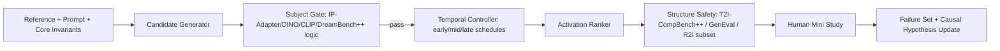

# PCA-B0 / CTAS Synthesis Blueprint

生成日期：2026-05-26

## 1. 统筹原则

本蓝图不寻找万能论文，而是把每个能力轴的 SOTA 积木组合成一个可实验系统。

```text
Subject gate 负责不丢主体。
Temporal controller 负责何时干预。
Causal space hypothesis 负责解释变量关系。
Activation ranker 负责美感/情绪/记忆排序。
Structure benchmark 负责防止漂亮但错误。
Human mini study 负责校准是否真的打动人。
```

PCA-B0 的升级版可以写成：

```text
Good Output =
  Subject Consistency Gate
  + Causal-Temporal Intervention
  + Perceptual Activation Ranking
  + Human Memory Calibration
```

## 2. 第一批实验系统

### 2.1 输入

| 输入 | 来源 |
|---|---|
| Reference image | 用户给定主体图或 DreamBench++/CustomConcept101 子集 |
| Prompt | PartiPrompts、自建 PCA-B0 prompt、少量情绪/记忆线索 prompt |
| Core invariants | 人工写明：主体、身份、对象、结构、不可丢元素 |
| Allowed variants | 风格、光照、构图、情绪、年代感、色彩 |
| Forbidden failures | 主体错、身份漂移、对象缺失、关系错、记忆线索被破坏 |

### 2.2 候选生成组

| 组别 | 生成逻辑 | 目的 |
|---|---|---|
| Raw | 固定 prompt + seed，普通生成 | 最低基线 |
| Subject-only | IP-Adapter 或 DreamBooth LoRA 加强主体 | 测主体保真但可能无激活 |
| Preference-only | 多 seed 后只按 ImageReward/PickScore/HPSv2 选 | 暴露漂亮但丢主体的问题 |
| Late-aesthetic | 早中期普通，后期增强风格/质感 | 测后期审美调制是否更安全 |
| Mid-affect | 中期增强情绪/语义 token attention | 测情绪注入对主体的影响 |
| CTAS | 早期锁主体/结构，中期调情绪/构图，后期调审美/质感 | 主方法 |

## 3. 能力轴接线图



## 4. CTAS 实验 A：时间调制是否减少主体漂移

### 问题

同样的审美或情绪增强，如果注入到不同扩散阶段，是否会产生不同程度的主体漂移？

### 设计

| 组别 | early | mid | late | 观测 |
|---|---|---|---|---|
| Baseline | 普通 | 普通 | 普通 | 原始主体通过率和激活分 |
| Early-style | 风格/情绪增强 | 普通 | 普通 | 是否最容易破坏主体/布局 |
| Mid-affect | 普通 | 情绪/构图增强 | 普通 | 是否提升情绪但改变语义 |
| Late-aesthetic | 普通 | 普通 | 质感/色彩增强 | 是否更安全提升美感 |
| CTAS | subject/layout lock | affect/composition tune | aesthetic/detail tune | 是否实现 gate 不降、activation 上升 |

### 指标

| 层 | 指标 |
|---|---|
| 主体 | CLIP-I / DINO similarity / DreamBench++ 风格 GPT/VLM judge |
| 美感 | ImageReward / PickScore / HPSv2 |
| 情绪 | ArtEmis/EmoSet 标签词或 CLIP emotion prompts |
| 记忆 | LaMem/THINGS/PerceptCLIP-Memorability proxy + 人类解释 |
| 结构 | T2I-CompBench++ / GenEval 子集 |
| 人类 | 盲评：更美、更动人、更像记忆、是否丢主体 |

### 成功条件

```text
CTAS 的 subject gate pass rate 不低于 Subject-only。
CTAS 的 aesthetic/emotion/memory proxy 高于 Subject-only。
CTAS 在人类盲评中比 Preference-only 更少丢主体。
CTAS 在“更像记忆/更打动人”选择上高于 Raw 和 Subject-only。
```

## 5. CTAS 实验 B：潜空间因果关系是否可观察

### 问题

当干预审美、情绪或记忆线索时，哪些主体变量最容易被破坏？

### 干预矩阵

| 干预 | 观察变量 | 可能因果边 |
|---|---|---|
| 增强风格强度 | 主体相似度是否下降 | `S_aes -> S_id` |
| 改变构图距离 | 情绪/亲密感是否变化 | `S_layout -> S_affect` |
| 增加怀旧色彩/物件 | 记忆代理和人类解释是否上升 | `S_mem -> S_aes` |
| 强化 identity adapter | 情绪/自然感是否僵硬 | `S_id -> S_affect` |
| 加强结构控制 | 美感是否下降 | `S_layout -> S_aes` |

### 输出

输出不是证明因果图，而是得到可观察假设：

```text
哪些干预更容易造成主体漂移？
哪些干预更容易提升激活但伤害结构？
哪些变量之间表现出稳定冲突？
```

## 6. CTAS 实验 C：个人记忆闭环

### 问题

通用偏好模型选出的漂亮图，是否真的比 CTAS 更能激活个人记忆？

### 标注协议

| 项 | 设计 |
|---|---|
| 参与者 | 3-5 人 |
| 每人任务 | 10-20 个记忆线索 |
| 每任务候选 | Raw / Subject-only / Preference-only / CTAS |
| 展示方式 | 2x2 blind contact sheet |
| 问题 1 | 哪张最保留主体？ |
| 问题 2 | 哪张最美？ |
| 问题 3 | 哪张最打动你？ |
| 问题 4 | 哪张最像你记忆里的感觉？ |
| 问题 5 | 哪些元素触发了回忆，哪些元素破坏了回忆？ |

### 输出

| 输出 | 用途 |
|---|---|
| choice table | 判断 CTAS 是否优于 baseline |
| explanation table | 抽取记忆触发线索 |
| failure set | 记录指标与人类冲突 |
| causal notes | 更新 `S_id/S_aes/S_affect/S_mem` 的关系假设 |

## 7. 第一批短名单

### 必跑

| 轴 | 必跑 |
|---|---|
| 主体 | IP-Adapter / DreamBooth LoRA SDXL 对照 |
| 时间 | Prompt-to-Prompt / Attend-and-Excite 思路下的 attention schedule |
| 美感 | ImageReward + PickScore + HPSv2 |
| 情绪 | ArtEmis/EmoSet 标签词 + CLIP/EmotionCLIP proxy |
| 结构 | T2I-CompBench++ + GenEval 子集 |
| 人类 | PCA-B0 blind mini study |

### 二轮接入

| 轴 | 二轮 |
|---|---|
| 主体 | DSH-Bench 完整 SICS 诊断 |
| 偏好 | VisionReward / MPS 多维偏好 |
| 记忆 | PerceptCLIP-Memorability / ViTMem |
| 推理 | R2I-Bench / ConceptMix |
| 文化 | THINGSplus / Dollar Street / GeoDE |

## 8. 论文表达

可以把创新写成三句话：

```text
1. 我们不把主体一致性视为审美生成的对立面，而视为感知激活的因果边界。
2. 我们把生成过程拆成可干预的时间阶段，并研究不同阶段干预对主体、美感、情绪、记忆的影响。
3. 我们不追求单一综合分，而是用正交能力轴统筹 SOTA，并通过人类小样本校准自动指标。
```

论文题目可暂定：

```text
Subject-Preserving Perceptual Activation via Causal-Temporal Control in Reference-Guided Image Generation
```

中文题目：

```text
主体一致性约束下的因果-时间感知激活生成
```
